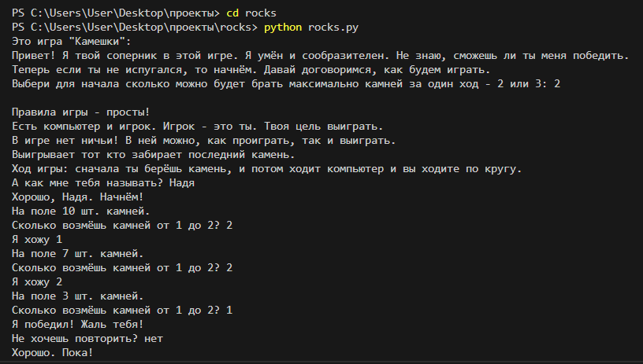

# Игра "Камешки"

## Оглавление

* [Оглавление](#оглавление)
* [Описание проекта](#описание-проекта)
    * [Правила игры](#правила-игры)
    * [Основные возможности](#основные-возможности)
    * [Как это работает?](#как-это-работает)
    * [Предварительные требования](#предварительные-требования)
* [Скрипты проекта](#cкрипты-проекта)
* [Основные скрипты](#основные-скрипты)
    * [rocks.py](#rockspy)   
* [Цель проекта](#цель-проекта)

## Описание проекта

Игра 'Камешки' - это игра сделанная на правилах делимости и разных типах данных.

### Правила игры

Правила игры:

1. За ход вы можете взять 1 или 2 или 1, 2 и 3 камешком.
2. Есть компьютер и игрок. Игрок - это ты. Твоя цель выиграть.
3. В игре нет ничьи! 
4. В ней можно, только проиграть.
5. Выигрывает тот кто забирает последний камень.

Ход игры: сначала ты берёшь камень, и потом ходит компьютер и вы ходите по кругу. Кто забирает последний камень тот побеждает!

### Основные возможности

1. Игра развивает логику и стратегию.
2. Игра позволяет детям учится проигрывать.

### Как это работает?

Перед работай потребуется сделать небольшое количество работ, чтобы его запустить, но что у вас получится обрадует вас.

По сути код принимает от тебя настройки игры, просит тебя представится, а потом работает по [правилам игры](#правила-игры).

### Предварительные требования:

1. Установленный Python версии 3.* и выше.

## Скрипты проекта:

* [rocks.py](#rockspy)

### rocks.py

#### Что делает скрипт?

С помощью этого инструмента мы выводим и обрабатываем информацию.

Для проверки его работы мы запускаем проект и смотрит всё ли так выводится.

#### Как запустить скрипт?

```bash
python rocks.py
```

#### Что выведет скрипт?

Пример запуска и вывода :

```
C:\Users\User> cd \Desktop\*Название файла с проектом*
C:\Users\User\Desktop\Create_random_pers> python rocks.py
```

В этом примере мы запускаем файл `rocks.py`.



## Цель проекта

Проект написан в образовательных целях для мановской работы и отработки своих навыков.